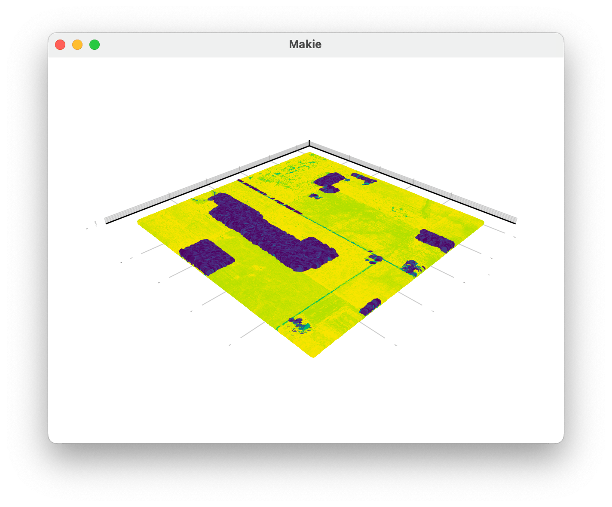

[](https://github.com/evetion/LazIO.jl/actions/workflows/ci.yml)
[](https://codecov.io/gh/evetion/LazIO.jl)


# LazIO
Extends LasIO with LASzip integration.

Uses the [LASzip](https://github.com/LASzip/LASzip/) shared library to read compressed las files (\*.laz) into the uncompressed format that [LasIO](https://github.com/visr/LasIO.jl) reads natively.

```julia
julia> using LazIO

# Open file and iterate over points
julia> ds = LazIO.open("test/libLAS_1.2.laz")
LazIO Dataset of test/libLAS_1.2.laz with 497536 points of version 0.

# Each point is correctly scaled and has its return_number and classification widened
julia> p = ds[1]
LazIO.Point0(1.44013394e6, 375000.23, 846.66, 0x00fa, 0x00, 0x00, 0x00, false, 2, false, false, false, 0x00, 0x001d)

# This results in accessible attributes, such as edge_of_flightline and withheld
julia> fieldnames(typeof(p))
(:x, :y, :z, :intensity, :return_number, :number_of_returns, :scan_direction, :edge_of_flight_line, :classification, :synthetic, :key_point, :withheld, :user_data, :point_source_id)

# LazIO implements the GeoInterface
julia> using GeoInterface
julia> GeoInterface.coordinates(p)
3-element Vector{Float64}:
      1.44013394e6
 375000.23
    846.66
julia> GeoInterface.extent(ds)
Extent(X = (1.44e6, 1.44499996e6), Y = (375000.03, 379999.99), Z = (832.1800000000001, 972.6700000000001))

# Or one can use the Tables interface
julia> using DataFrames
julia> DataFrame(ds)
497536×14 DataFrame
    Row │ x          y               z        intensity  return_number  number ⋯
        │ Float64    Float64         Float64  UInt16     UInt8          UInt8  ⋯
────────┼───────────────────────────────────────────────────────────────────────
      1 │ 1.44013e6       3.75e5      846.66        250              0         ⋯
      2 │ 1.44012e6       3.75e5      846.55        245              0
      3 │ 1.44011e6       3.75001e5   846.44        239              0
      4 │ 1.4401e6   375001.0         846.32        251              0
      5 │ 1.44009e6       3.75001e5   846.21        229              0         ⋯
      6 │ 1.44009e6       3.75002e5   846.1         249              0
      7 │ 1.44008e6       3.75002e5   846.0         189              0
      8 │ 1.44007e6       3.75002e5   845.9         250              0

```

Plotting is done via either the Plots, or Makie ecosystem. The latter is recommended for large datasets.

```julia
julia> # using Plots
julia> using GLMakie
julia> plot(ds)
```

